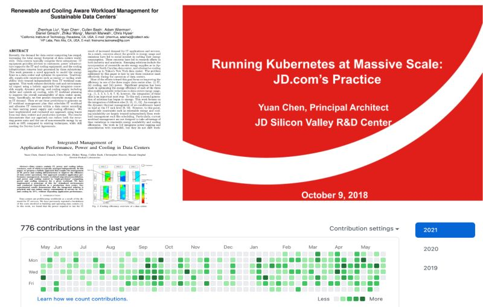

### Hi there 👋

<!--
**yuanchen8911/yuanchen8911** is a ✨ _special_ ✨ repository because its `README.md` (this file) appears on your GitHub profile.
-->
Here are some ideas to get you started:

- 🔭 I’m currently working on could native computing and kubernetes: [contributions to kubernetes](https://k8s.devstats.cncf.io/d/66/developer-activity-counts-by-companies?orgId=1&var-period_name=Last%202%20years&var-metric=contributions&var-repogroup_name=All&var-repo_name=kubernetes%2Fkubernetes&var-country_name=All&var-companies=Apple).
- 💬 Ask me about kubernetes, cluster scheduling
- 📫 How to reach me: https://www.linkedin.com/in/yuanchen/
- 😄 Pronouns: he/him
- ⚡ Fun fact: career path

    **R -> R&d -> r&D -> D**
    
    **Research Scientist -> Ressearch Engineer -> Software Architect -> Software Engineer**
    
    
